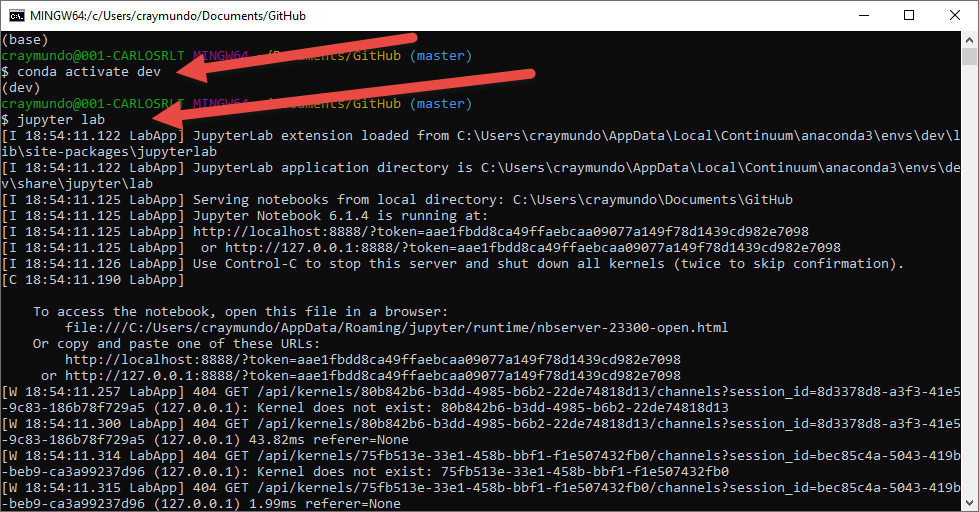

# Crypto_Porfolio_K-means

This is a Jupyter Notebook that uses Pandas hvplot and scikit-learn in a Conda enviroment.  In this exercise, we combine Python programming skills with unsupervised learning techniques to cluster a crypto porfolio based on performance in differnt time periods.  The data then gets plot to illustrate the insights, Explore, discover and have fun using this notebook.

---


## Technologies

This project leverages python 3.7 with the following packages:

* [Pandas](https://pandas.pydata.org/docs/user_guide/visualization.html) - For the command line interface, help page, and entrypoint.

* [JupyterLab](http://jupyterlab.io/) - For interactive user workspace that utilizes Notebook.

* [matplotlib](https://plotly.com/python/px-arguments/) - Plotly Express Arguments in Python.

* [Scikit-Learn] (https://scikit-learn.org/stable/) - tools for machine learning and statistical modeling including classification, regression, clustering and dimensionality reduction.
---

## Installation Guide

Before running the application first install the following dependencies in your designated environment.


* [Git Bash (Windows) or Terminal (macOS)] (https://git-scm.com/downloads) -  
* [Anaconda with Python 3.7] (https://docs.anaconda.com/anaconda/install/) - 
* [installing the Requests library] (conda install -c anaconda requests)
* [install PyViz] 
    - conda install -c plotly plotly=4.13.
	- conda install -c pyviz hvplot
* [Install scikit-learn]
    - pip install -U scikit-learn


--- 

## Examples

This section includes screenshots of few plots that can easyly be obtain by running this notebook.

- Plotting a line chart illustrating the crypto porfolio price return performance.

- Plotting the Elbow Curve to find the best value for K.

- Plotting 2 charts in one column to compare k=4 and k=5 in the data sets.


---

## Usage

To use HousingRentalAnalysisForSanFrancisco book simply clone the repository and run "Git Bash" with:

```
- Start by activating an Anaconda Environment instance.
- Then follow by starting Jupyter Lab

```
Upon launching the loan qualifier application you will be greeted with the following prompts.


---

## Contributors

Brought to you by Carlos R. you may reach me at reachcarlostoday@gmail.com

---

## License

MIT.